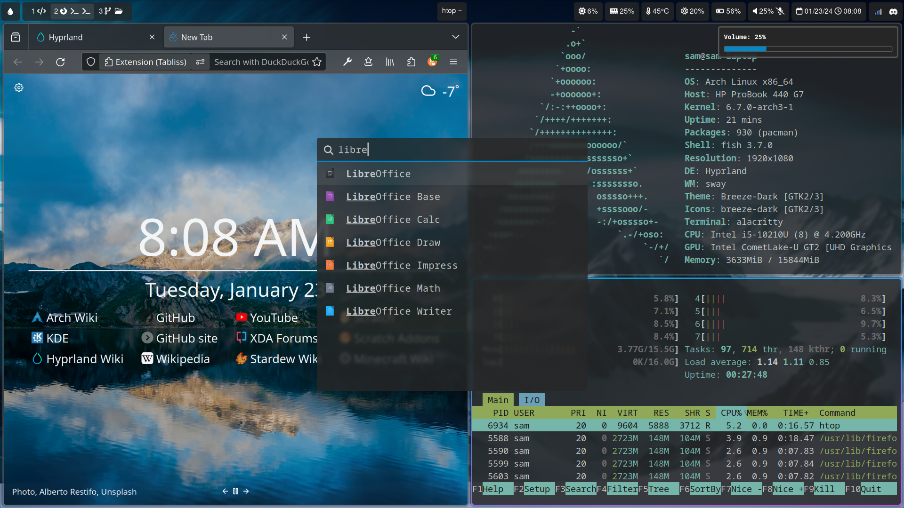

# Samq64's Linux dotfiles

My Linux dotfiles. A lot of them are vary basic or barely modified but others are more advanced.


## Hyprland setup



The full Hyprland setup uses the following:

- [Alacritty](https://github.com/alacritty/alacritty)
- Breeze theme
- [Brightnessctl](https://github.com/Hummer12007/brightnessctl)
- [Dunst](https://github.com/dunst-project/dunst)
- Firefox
- [Font Awesome](https://github.com/FortAwesome/Font-Awesome)
- Grim
- [GTKLock](https://github.com/jovanlanik/gtklock)
- [Hyprpaper](https://github.com/hyprwm/hyprpaper)
- Htop
- lxsession-gtk3
- network-manager-applet
- PipeWire
- PulseAudio volume control
- [Rofi (Wayland fork)](https://github.com/lbonn/rofi)
- [Rofimoji](https://github.com/fdw/rofimoji)
- [Slurp](https://github.com/emersion/slurp)
- [Swayidle](https://github.com/swaywm/swayidle)
- [Udiskie](https://github.com/coldfix/udiskie)
- Thunar
- [VSCode](https://github.com/microsoft/vscode)
- [Waybar](https://github.com/Alexays/Waybar)

## Copying the files

Install GNU Stow and run

```bash
git clone https://github.com/samq64/dotfiles
cd dotfiles
stow -t ~/ .
```

## List of configurations

- Alacritty
- Bash
- Conky
- Dunst
- Hyprland
- Neovim
- Polybar
- Qtile
- Rofi
- Starship
- Waybar
- Zsh
